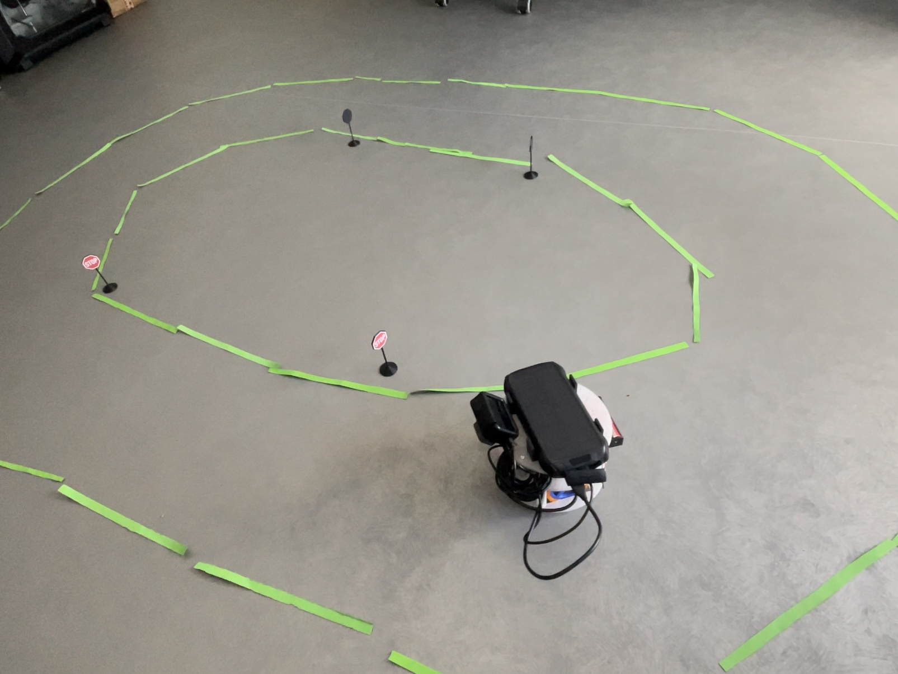
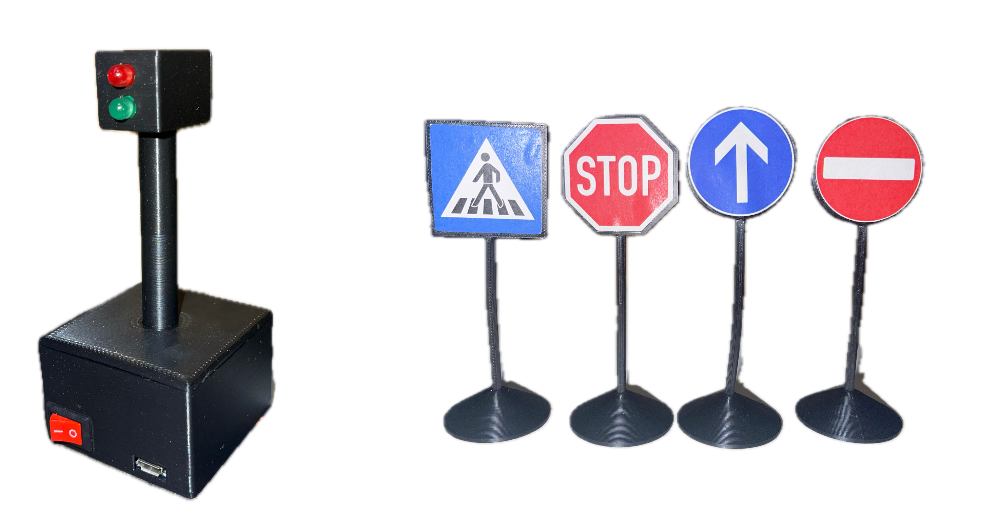

# Autonomous Driving Robot

## Main Goal

This project is related to the development of an autonomous driving robot, which was part of my bachelor's thesis. The main goal of the robot is to navigate autonomously in an specific environment by following lane markings and obeying traffic signs and lights. The robot is equipped with a camera for vision capabilities, and it is able to detect traffic signs and lights, and react accordingly.

 

## Development

The robot was developed by starting with the [open-source platform ORP](https://openroboticplatform.com/) and designing new components or customizing some of the already available pats. For the development of the robot, I used a Raspberry Pi 5 as the main controller and a GoPro camera connected to it for the vision capabilities of the robot.

The robot can navigate autonomously by predicting the steering angle for each frame captured by the camera, and then computing the actual motor wheel power to follow the desired trajectory. It can detect traffic signs and lights and react accordingly. For example, when a stop sign is detected, the robot will stop in front of the sign and wait for 2 seconds or when the red light is detected, it will stop until the red light turns green. The model used for the prediction of the steering angle is a convolutional neural network, Resnet18, which was fine-tuned on a dataset of images captured with the robot and manually annotated. Traffic signs and lights detection is performed using the pretrained YOLOv8n model fine-tuned on a dataset of images captured with the robot and manually annotated.

A demo video part of an entire playlist of videos related to the robot and the development process can be found below:

## Robot Environment 

To develop the autonomous robot, I had to prepare the environment for the robot, which consisted of strips of paper (as lane markings), traffic signs, and traffic lights that were 3D modeled and printed. Each traffic light was equipped with two LEDs, an Arduino Nano board for control, and powered from a recycled disposable vape battery.

 

## Future Work

I am looking forward to improve the robot by implement it using ROS2 and simulate it in Gazebo. Also, I want to improve the robot's perception capabilities by adding LiDAR sensor and implement SLAM algorithms. Another improvement would be to add a robotic arm to the robot to be able to interact with the environment and perform tasks like picking up objects and placing them in a specific locations. I am also thinking of implementing Vison Language Action (VLA) capabilities to the robot, which would allow it to understand and execute commands given by a human. 